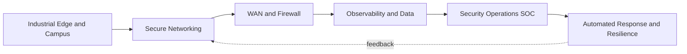

# 02 · Market Context & Strategy

> **Summary.** The market is consolidating vendors and buying outcomes, not products. Cisco + Splunk can now credibly own the full stack from the industrial edge to the SOC — a story competitors can't match end-to-end. The Field CTO X-Arch motion is how we convert portfolio completeness into C-suite-led, multi-architecture wins in four high-attach verticals.

---

## 1. Market context — three forces

**Force 1: Vendor consolidation.** CIOs and CISOs are under board pressure to reduce vendor sprawl for cost, risk, and operational simplicity. Consolidation decisions are inherently cross-architecture and made at the executive level — the natural entry point for a Field CTO.

**Force 2: Outcome-based buying.** Buyers increasingly fund business outcomes (cyber resilience, operational uptime, cost-to-serve, compliance, safe operations) rather than technology categories. Whoever frames the outcome-to-architecture mapping shapes the budget.

**Force 3: Convergence of IT, security, and operations.** Observability and security are merging (detection, response, resilience), IT and OT are converging (connected fleets, ports, rail, industrial and critical-infrastructure systems), and AI infrastructure ties networking, security, and data together. Convergence rewards a seller who can speak across all of it.

## 2. The post-Splunk opportunity

The Splunk acquisition is strategically significant precisely because it completes the "sense → connect → secure → understand → act" loop:

Each arrow is a cross-sell opportunity that only materializes if someone connects the customer's outcome to the whole loop. Today, most sellers own one box. The Field CTO owns the arrows.

**The core synergy to monetize:** attach **Splunk** (observability + security operations) to Cisco's enormous networking/security install base, and attach **Cisco security/networking** into Splunk's data-platform accounts. That bi-directional attach is the single most valuable, most under-executed post-acquisition play.

## 3. The X-Arch value thesis

Cross-architecture selling changes the economics of a deal along four axes:

| Axis | Single-architecture motion | X-Arch (Field CTO) motion |
|------|----------------------------|----------------------------|
| **Deal size** | One product line | Multi-architecture solution → 30–50% larger (illustrative) |
| **Stickiness / churn** | Point product, replaceable | Integrated outcome, high switching cost |
| **Margin** | Competitive on the component | Value-priced on the outcome; less commoditized |
| **Relationship** | Buyer / procurement | CxO trusted advisor |
| **Cross-sell velocity** | Slow, opportunistic | Designed-in from the reference architecture |

The thesis: a small number of senior people who reliably move accounts from the left column to the right column generate outsized, compounding return.

## 4. Architecture focus — the "3 + 1" thesis (justified)

We deliberately do **not** try to lead with the entire Cisco portfolio. The pilot leads with the three architectures that have the strongest cross-attach and the clearest executive narrative, plus one high-growth adjacency:

| # | Architecture pillar | Components (lead) | Why it leads |
|---|---------------------|-------------------|--------------|
| 1 | **Secure Networking** | Catalyst, Meraki, SD-WAN, Catalyst Center + Secure Firewall, ISE, XDR, Duo | Cisco's install-base anchor; the beachhead for everything else |
| 2 | **Full-Stack Observability & Data** | Splunk (Platform, ES, ITSI, OT), ThousandEyes, AppDynamics | The Splunk synergy engine; turns the network into insight |
| 3 | **Resilience & Security Operations** | Splunk ES + Cisco XDR + SOAR | The post-Splunk crown jewel; board-level cyber-resilience story |
| +1 | **AI-Ready Infrastructure** | UCS, Nexus, AI PODs | Pull-through adjacency; AI builds drag the other three forward |

**Deliberately de-prioritized as "attach, not lead":** Collaboration (Webex) and pure compute. They remain in the bag as attach, but they don't anchor the C-suite narrative in the focus verticals.

## 5. Vertical focus — four, justified

We concentrate on four verticals selected on three criteria: (a) high natural cross-architecture attach, (b) strong regulatory/resilience pull that elevates the conversation to the C-suite, and (c) joint Cisco + Splunk strength (including the OT/ICS motion).

| Vertical | Why it's chosen | Signature X-Arch pull |
|----------|-----------------|-----------------------|
| **Transportation & Logistics** | Distributed, IoT-dense operations across ports/rail/airports/fleets/warehouses; supply-chain resilience + real-time visibility; transport is critical infrastructure | Distributed-site secure networking + IoT/asset visibility (Splunk) + digital-platform observability + passive transport-OT security (NIS2) |
| **Financial Services** | Regulatory resilience mandates + fraud + always-on digital experience; huge Cisco + Splunk footprint | Cyber resilience (DORA), fraud analytics, full-stack observability of digital channels |
| **Healthcare** | Explosion of connected medical devices + patient-safety uptime + strict privacy | Medical-device IoT security, clinical-system observability, HIPAA-aligned SecOps |
| **Public Sector / Critical Infrastructure** | Compliance mandates (NERC-CIP, NIS2), threat environment, modernization budgets | Critical-infrastructure protection, SOC modernization, network + OT security |

Each vertical's detailed architecture map, bundles, use cases, and proof points are in [`04-vertical-solution-map.md`](04-vertical-solution-map.md). The list is **swappable** — if leadership prefers Retail, Service Provider, or Energy as a discrete vertical, the model accommodates it without changing the operating design.

## 6. Segmentation & sizing approach (TAM → SAM → focus)

We size the opportunity top-down and bottom-up, keeping every input visible for leadership to calibrate (see [`06-financial-model.md`](06-financial-model.md)):

- **TAM (top-down):** the combined spend in the four verticals across the "3 + 1" architectures within Cisco's addressable enterprise/public-sector segments.
- **SAM (serviceable):** accounts where Cisco already has a networking/security foothold (warm base for Splunk attach) **plus** Splunk accounts with weak Cisco networking/security attach.
- **Focus set (pilot):** a curated list of **~40–60 named accounts** (roughly 5–8 per Field CTO) chosen for size, existing relationship, and cross-sell headroom, each paired with a **control account** for clean attribution.

**Account selection filters:**
1. Strategic size (multi-year, multi-architecture budget potential)
2. Existing Cisco or Splunk foothold to expand from
3. A live business trigger (regulatory deadline, breach, modernization, M&A, AI build)
4. Accessible C-suite / executive sponsor

## 7. Competitive framing

The Field CTO motion is aimed squarely at the actors who currently own the strategic frame:

| Competitor type | How they win today | How the Field CTO counters |
|-----------------|--------------------|-----------------------------|
| **Point-product vendors** (e.g., single-domain networking, security, or observability players) | Best-of-breed in one box | Reframe to the *integrated outcome* the customer actually funds; one throat to choke |
| **Observability/SIEM specialists** | Own the data/SOC conversation | Lead with Splunk *plus* the network and security context competitors can't natively supply |
| **System integrators / consultancies** | Own the reference architecture and the CxO trust | Bring Cisco's own senior technologist to co-own the architecture and protect margin |
| **Hyperscalers / cloud-native stacks** | Bundle observability/security into cloud | Differentiate on hybrid, OT/edge, and the physical + industrial network they don't own |

The recurring theme: whoever frames the architecture wins the budget. The Field CTO exists to make sure that is Cisco.

## 8. Positioning vs. existing field roles (no overlap, pure leverage)

| Role | Primary focus | Quota | Relationship to Field CTO |
|------|---------------|-------|----------------------------|
| **Account Executive / GAM** | Account ownership & commercials | Yes (account) | Field CTO is their senior technical strategist for the biggest cross-arch plays |
| **BU / product specialist seller** | Depth in one architecture | Yes (product) | Field CTO frames the deal, then pulls them in to detail & close their component |
| **Systems Engineer (SE)** | Technical validation, POC, design detail | No (support) | Field CTO sets the architecture; SEs execute the detailed design/POC |
| **Field CTO seller** | Cross-architecture, outcome-led, C-suite | Influence-credited | The connective tissue that makes all of the above more productive |

The Field CTO is explicitly **not** a replacement for, or duplicate of, any existing role. It is a thin senior layer whose only job is to make the whole portfolio sell as one.

---

*Continue to [`03-role-requirements.md`](03-role-requirements.md) for the exact role definition, competencies, and org design.*
