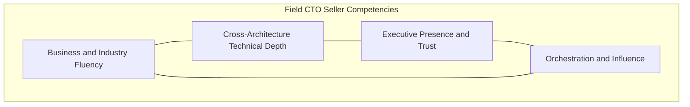
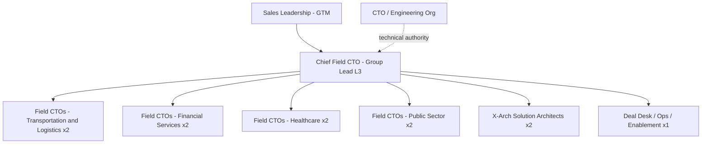

# 03 · Role Definition & Requirements

> **Summary.** A Field CTO seller is a senior, business-fluent technologist who leads cross-architecture, outcome-based deals at the C-suite and orchestrates BU specialists to land them. This document defines the role, the competency and skills matrix, leveling, the coverage and org model, the hiring profile, and the RACI that keeps the team leverage-positive and conflict-free with existing account and BU teams.

---

## 1. Role definition

**Mission:** Convert Cisco + Splunk portfolio completeness into C-suite-led, multi-architecture outcomes in a focused vertical.

**Mandate:**
1. Own the executive business conversation (CIO/CISO/COO/CDO) in the customer's language.
2. Author the cross-architecture reference architecture that spans the "3 + 1" pillars.
3. Orchestrate account teams, BU sellers/SEs, Splunk specialists, CX, and partners to detail and close each component.
4. Grow and defend the strategic Cisco relationship so the customer treats Cisco as a partner, not a supplier.

**Explicitly not:** a product-overlay SE, a solo closer who hoards deals, or a replacement for account/BU roles. Leverage — not territory — is the point.

## 2. Competency model (the four pillars)

| Pillar | What it means | How it shows up |
|--------|---------------|-----------------|
| **Business & industry fluency** | Speaks the vertical's economics, regulations, and pressures fluently | Frames deals as risk/resilience/cost/growth, not SKUs |
| **Cross-architecture technical depth** | Credible across networking, security, observability/Splunk, and AI-ready infra — deep in ≥2, conversant in all | Designs the reference architecture live, in the room |
| **Executive presence & trust** | Holds a peer-level CxO conversation and earns advisory status | Invited back; shapes the customer's roadmap |
| **Orchestration & influence** | Mobilizes the extended team without direct authority | Deals move faster because they connect the right people |

## 3. Skills & knowledge matrix

Proficiency scale: **1 = aware · 2 = conversant · 3 = proficient · 4 = expert.** Target profile shown per domain.

| Domain | Skill / knowledge | Target | Notes |
|--------|-------------------|--------|-------|
| **Secure Networking** | Campus/branch (Catalyst, Meraki), SD-WAN, Catalyst Center | 3 | Deep for at least 1 of the 3 pillars |
| | Security (Secure Firewall, ISE, XDR, Duo) | 3 | |
| **Observability & Data** | Splunk Platform, ES, ITSI, OT | 3–4 | The synergy engine — bias to depth here |
| | ThousandEyes, AppDynamics | 2–3 | Digital experience narrative |
| **Security Operations** | SOC modernization, SOAR, detection engineering, MITRE ATT&CK | 3 | Board-level resilience story |
| **AI-Ready Infra** | UCS/Nexus, AI POD reference designs | 2 | Pull-through adjacency, not lead |
| **Vertical** | Regulations & operating models (e.g., NIS2, DORA, HIPAA, NERC-CIP) | 3–4 | One primary vertical, one secondary |
| **Business** | Value engineering / TCO / ROI modeling | 3 | Builds the business case with the customer |
| | Executive storytelling & whiteboarding | 4 | The differentiating soft skill |
| **Sales** | Complex/consultative & consolidation selling | 3 | Multi-year, multi-stakeholder |
| **OT safety** | Read-only/passive acquisition, human-in-the-loop boundary | 3 | Mandatory for OT-touching verticals (see [`04`](04-vertical-solution-map.md)) |

**Coverage rule:** each Field CTO is **deep (3–4) in at least two** of the three technical pillars and **conversant (2+) in all**, plus **deep in one vertical**. The team as a whole must cover all pillars and all four verticals at expert level.

### A week in the life (what "good" looks like)

The role is roughly a third executive engagement, a third architecture/orchestration, and a third enablement/leverage — deliberately *not* dominated by any single deal's execution detail:

| Time | Activity | Why it matters |
|------|----------|----------------|
| ~35% | CxO conversations, executive briefings, advisory sessions | Where X-Arch deals are framed and won |
| ~35% | Designing reference architectures; orchestrating the extended team | Turns the frame into a buildable, closeable solution |
| ~20% | Enabling account/BU teams; refreshing plays; peer review | Scales the motion beyond one person's calendar |
| ~10% | Internal roadmap access, vertical research, references | Keeps credibility current |

**A Field CTO is over-invested if** they are doing detailed POC configuration or single-product quoting — that is SE/BU-specialist work they should be orchestrating, not performing.

## 4. Leveling

| Level | Title | Profile | Typical scope |
|-------|-------|---------|---------------|
| L1 | **Field CTO** | Senior technologist, strong in 2 pillars + 1 vertical | 5–8 named accounts |
| L2 | **Principal Field CTO** | Recognized authority; regional/vertical thought leader | 3–5 marquee accounts + coaching |
| L3 | **Chief Field CTO (group lead)** | Runs the group; owns strategy, comp model, exec relationships | Group leadership + top strategic accounts |

The pilot staffs primarily at **L1** with **one L3** group lead; L2 emerges as the team matures.

**Black Ops deployment mode.** The most senior tier (L2 Principal / L3) can be convened as an elite, time-boxed **tiger team** — the "Black Ops" mode — that parachutes into the hardest, highest-value accounts to break them open, then hands them back to sustained coverage. This is an *operating mode drawn from the same talent pool*, not (initially) separate headcount. Full definition, deployment criteria, and RACI in [`09-black-ops-seller.md`](09-black-ops-seller.md); a worked application in [`10-example-engagement-aviation.md`](10-example-engagement-aviation.md).

## 5. Coverage & org model

**Coverage math (pilot):** 8 Field CTOs × ~5–8 named accounts = **~40–60 focus accounts**, 2 per focus vertical, each paired with control accounts for attribution.

**Org placement — recommendation:** the group reports into **senior sales leadership** (GTM) with a **strong dotted line to the CTO/engineering organization** for technical authority and portfolio roadmap access. This placement keeps it revenue-accountable while protecting its technical credibility and cross-BU neutrality.

**Why GTM-primary, CTO-dotted:** a pure engineering placement risks the team being seen as non-revenue and losing sales pull; a pure sales placement risks it being pushed toward single-product quotas. The dual line preserves both revenue accountability and cross-architecture neutrality.

## 6. Compensation philosophy (design principle, detailed in [`05`](05-operating-model.md))

- **Influence-credited, not single-product quota.** Comp rewards the *total* multi-architecture outcome and Splunk cross-attach in touched accounts.
- **Shared success with BU teams.** Deliberately non-zero-sum: BU sellers keep their credit; the Field CTO earns influence credit — so BU teams *want* the Field CTO in the room.
- **Leading-indicator component.** A portion tied to leading indicators (C-suite relationships created, X-Arch opportunities framed) to reward the right behavior early.

## 7. Hiring profile & sourcing

**Ideal candidate signals:**
- 12+ years spanning at least two of: networking, security, observability/data, data center.
- Demonstrated C-suite advisory experience (they've been in the room and been invited back).
- Vertical depth (they can name the regulations and operating pressures without notes).
- Reputation as a connector/orchestrator, not a lone wolf.
- Teaching instinct — they make others better.

**Sourcing strategy (internal-first):**
1. **Identify internal talent first** — Cisco/Splunk already employs many of these people as senior SEs, architects, and CTO-office staff. Internal hires ramp fastest and carry relationships.
2. **Selective external hires** — for vertical depth or Splunk depth gaps.
3. **Ramp program** — a structured enablement path (see [`05`](05-operating-model.md)) closes the "conversant → proficient" gaps across pillars.

**Anti-patterns to screen out:** deep-but-narrow single-product experts with no business fluency; strong presenters with shallow technical depth; closers who won't share credit.

### Interview scorecard (assess each candidate 1–4 against the competency pillars)

| Dimension | What to probe | Evidence of a 4 (expert) |
|-----------|---------------|---------------------------|
| **Business & industry fluency** | "Walk me through the economics and top 3 risks of [their vertical]." | Names regulations, cost drivers, and operating pressures unprompted; frames tech as business outcome |
| **Cross-architecture depth** | "Whiteboard a resilient architecture for [scenario] spanning network, data, and SOC." | Designs across ≥3 architectures live; explains trade-offs, not just products |
| **Executive presence** | "Tell me about a CxO relationship you built and what came of it." | Concrete story of being invited back and shaping a roadmap |
| **Orchestration & influence** | "Describe getting a cross-functional team to a win without authority." | Credits others; shows the mechanism, not heroics |
| **Splunk / observability depth** | "How would you attach observability to an existing network estate?" | Fluent in the synergy play; connects data to outcomes |
| **Values / share-credit** | "How do you handle credit on a team win?" | Instinctively additive; makes others better |

**Hiring bar:** average ≥ 3 across dimensions, **≥ 4 on at least one of** business fluency or executive presence (the differentiators), and **no 1s** on cross-architecture depth or share-credit (disqualifiers).

### 90-day onboarding (ties to the enablement ramp in [`05`](05-operating-model.md#3-enablement--ramp))

| Days | Milestone | Deliverable |
|------|-----------|-------------|
| 0–30 | Portfolio + play fluency; vertical immersion | Pass play certification; account/control list drafted |
| 30–60 | Shadow live deals; build first executive narrative | Deliver a mock CxO briefing; co-run a real framing |
| 60–90 | Own accounts with coaching | First X-Arch opportunity framed and in pipeline |

## 8. RACI vs. existing teams

Legend: **R** = Responsible · **A** = Accountable · **C** = Consulted · **I** = Informed.

| Activity | Field CTO | Account Exec / GAM | BU Specialist Seller | SE | Splunk Specialist |
|----------|-----------|--------------------|-----------------------|-----|-------------------|
| Account ownership & commercials | C | **A/R** | C | I | C |
| C-suite outcome framing | **A/R** | C | I | I | C |
| Cross-architecture reference architecture | **A/R** | I | C | C | C |
| Component-level design & POC | C | I | C | **R** | R |
| Component-level close | I | C | **R** | C | R |
| Splunk cross-attach strategy | **R** | C | I | I | **A** |
| Deal orchestration / extended team | **A/R** | C | C | C | C |
| Forecast & booking credit | C | **A/R** | R | I | R |

The Field CTO is **Accountable for the cross-architecture frame and orchestration**; the Account Exec remains **Accountable for the account and commercials**. No role loses its core accountability.

---

*Continue to [`04-vertical-solution-map.md`](04-vertical-solution-map.md) for the vertical × architecture plays.*
