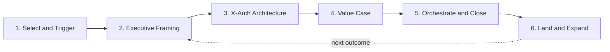
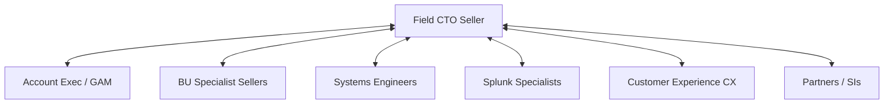

# 05 · Operating Model

> **Summary.** How the Field CTO group actually runs: the engagement lifecycle, the repeatable "plays," the enablement ramp, the tooling, how it aligns with account teams / BUs / CX / partners, the compensation design, and the KPI framework (leading and lagging) that proves the motion works.

---

## 1. Engagement lifecycle

| Stage | What the Field CTO does | Output | Extended team |
|-------|-------------------------|--------|---------------|
| **1. Select & trigger** | Confirm the account fits filters and has a live business trigger | Qualified target + control pair | Account Exec, group lead |
| **2. Executive framing** | Run a CxO outcome conversation; agree the business problem | Executive alignment / outcome statement | Account Exec |
| **3. X-Arch architecture** | Design the cross-architecture reference architecture | Reference architecture + roadmap | SEs, BU specialists, Splunk specialists |
| **4. Value case** | Co-build the business case (TCO/ROI/risk) with the customer | Value case / business case | Value engineering, finance |
| **5. Orchestrate & close** | Pull BU sellers/SEs to detail and close each component | Multi-architecture proposal → booking | BU sellers, SEs, deal desk, partners |
| **6. Land & expand** | Ensure adoption; tee up the next outcome | Reference + expansion pipeline | CX, account team |

**Cycle-time target:** first executive framing within 30 days of account selection; first X-Arch opportunity in pipeline within 60–90 days.

## 2. The plays (repeatable motions)

Each play is a packaged, reusable motion with a discovery script, a reference architecture pattern, a value-case template, and proof points. Drawn from [`04-vertical-solution-map.md`](04-vertical-solution-map.md):

| Play | Anchor pillar | Cross-attach | Primary verticals |
|------|---------------|--------------|-------------------|
| **Splunk-attach-to-network** | Observability | Networking, SecOps | All |
| **SOC modernization** | Resilience & SecOps | Observability, Networking | FinServ, Healthcare, Public Sector |
| **Full-stack digital experience** | Observability | Networking | FinServ, Healthcare, Transportation & Logistics |
| **Passive OT visibility** | Observability + Networking | SecOps | Transportation & Logistics, Public Sector/Utilities |
| **Consolidation TCO** | Any | All | All |

**Play maintenance:** the group lead and solution architects own the play library; each play is refreshed quarterly with new proof points and updated integration capabilities.

### Play card format (each play is documented this way)

Every play in the library follows one structure so any Field CTO or account team can run it consistently:

| Field | Contents |
|-------|----------|
| **Trigger** | The business event that opens the play (breach, mandate, outage, AI build, renewal) |
| **Buyer** | The executive(s) who own the outcome |
| **Discovery questions** | 4–6 questions that surface the pain and quantify it |
| **Reference architecture** | The multi-architecture solution pattern (diagram + components) |
| **Value case** | The TCO/ROI/risk template and the metrics that move |
| **Proof points** | Joint-solution references and demos to lead with |
| **Objection handling** | The top 3 objections and responses |
| **Extended team** | Which specialists to pull in and when |

### Example play card — "Splunk-attach-to-network"

- **Trigger:** a large Cisco networking estate with little/no Splunk; a resilience or visibility gap surfaces.
- **Buyer:** CIO (operations/cost) and/or CISO (risk).
- **Discovery questions:** "How much of your network do you have real-time visibility into?" · "When something breaks, how long to isolate whether it's network, app, or security?" · "What are you paying across your current monitoring/SIEM tools?" · "What can't you see today that you wish you could?"
- **Reference architecture:** Cisco network telemetry → Splunk Platform/ITSI for operations + Splunk ES/XDR for security, with ThousandEyes for external path.
- **Value case:** consolidation TCO + faster MTTR + risk reduction.
- **Proof points:** Cisco+Splunk joint telemetry integrations; before/after MTTR references.
- **Objection handling:** "We have a monitoring tool" → *one correlated view vs. many silos.* "Splunk is expensive" → *TCO of consolidation + value of the data you already generate.* "Not the right time" → *start with one high-pain domain and expand.*
- **Extended team:** Splunk specialist (co-lead), networking SE, account exec.

## 3. Enablement & ramp

A structured program closes the "conversant → proficient" gaps identified in the [skills matrix](03-role-requirements.md#3-skills--knowledge-matrix).

| Phase | Weeks | Focus | Exit criteria |
|-------|-------|-------|---------------|
| **Foundation** | 1–4 | Portfolio fluency across "3 + 1"; Splunk depth; the plays | Pass play certification |
| **Vertical immersion** | 3–6 (overlap) | Deep dive on primary vertical (regs, economics, references) | Deliver a mock CxO briefing |
| **Shadow & reverse-shadow** | 5–10 | Ride-along on live X-Arch deals | Lead a framing session observed |
| **Live with coaching** | 10+ | Own accounts with group-lead coaching | First opportunity framed |

**Ongoing enablement:** monthly play refresh, quarterly vertical deep-dives, a shared win/loss library, and peer review of reference architectures. Leverage the existing Cisco + Splunk skill assets (the workspace's methodology skills for OT safety, Splunk ES/ITSI/OT, Cisco product integrations) as a technical backbone.

**Foundation curriculum (modules):**

| Module | Covers | Format |
|--------|--------|--------|
| Portfolio fluency | The "3 + 1" pillars end-to-end; how the pieces integrate | Workshop + lab |
| Splunk synergy depth | Platform, ES, ITSI, OT; the attach plays | Hands-on lab |
| Executive selling | Outcome framing, whiteboarding, value engineering | Practice + role-play |
| Vertical immersion | Regs, economics, references for the primary vertical | Deep-dive + guest experts |
| OT safety (OT verticals) | Read-only/passive, human-in-the-loop boundary | Required certification |
| The plays | Running each play card; discovery scripts; objection handling | Certification |

## 4. Tooling

| Need | Tool / mechanism |
|------|------------------|
| Account & control tracking | CRM with an **influence ledger** (X-Arch opportunities, architectures per deal, attach) |
| Reference architectures | Shared architecture library + diagram standards |
| Value cases | Standardized TCO/ROI templates |
| Metrics & attribution | Dashboard comparing touched vs. control accounts |
| Knowledge | Play library, win/loss library, proof-point repository |
| Technical depth | Cisco + Splunk demo/lab environments; joint-solution sandboxes |

## 5. Alignment model (leverage, not conflict)

- **Account teams:** the Field CTO is their senior technical strategist for the biggest cross-arch plays; the AE keeps account ownership and commercials.
- **BU specialists & SEs:** the Field CTO frames and orchestrates; specialists detail and close their component and keep their credit.
- **Splunk specialists:** co-own the cross-attach strategy (see RACI in [`03`](03-role-requirements.md#8-raci-vs-existing-teams)).
- **CX:** engaged early so the "land & expand" adoption motion is designed in, not bolted on.
- **Partners / SIs:** the Field CTO co-owns the architecture *with* strategic partners rather than ceding it — protecting margin and the Cisco relationship.

**Governance:** a lightweight weekly deal sync (Field CTO + AE + relevant specialists) and a monthly group review (pipeline, plays, wins/losses, metrics) run by the group lead.

## 6. Compensation design

Principles from [`03`](03-role-requirements.md#6-compensation-philosophy-design-principle-detailed-in-05); mechanics here.

| Component | Weight (illustrative) | Basis |
|-----------|:---:|-------|
| **Influence credit on touched-account bookings** | 50% | Multi-architecture bookings in accounts the Field CTO led |
| **Splunk cross-attach** | 20% | Splunk attach uplift vs. control in touched accounts |
| **Leading indicators** | 15% | C-suite relationships created, X-Arch opportunities framed |
| **Team / strategic MBOs** | 15% | Play development, references, coaching, coverage |

**Non-zero-sum by design:** influence credit is *additive* — BU sellers keep 100% of their product credit, so the org wants the Field CTO involved. Deal desk arbitrates influence credit using the ledger to prevent disputes.

## 7. KPI framework

**Leading indicators (behavior — measured monthly):**
- # of C-suite/executive relationships created or deepened
- # of X-Arch opportunities framed (multi-architecture, outcome-led)
- Architectures per opportunity (target ≥ 3 on led deals)
- Reference architectures produced; plays run
- Time from account selection → first executive framing

**Lagging indicators (results — measured quarterly):**
- Influenced pipeline ($) and influenced/accelerated bookings ($)
- Average deal size: touched vs. control accounts
- Splunk cross-attach rate: touched vs. control
- Win rate on X-Arch deals vs. baseline
- Multi-year / multi-architecture contract value
- Customer references and advisory relationships created

### KPI definitions (how each is calculated)

| KPI | Definition / formula | Cadence |
|-----|----------------------|---------|
| **Influenced pipeline** | Σ open-opportunity value where the Field CTO is recorded as an influencer in the ledger | Monthly |
| **Incremental bookings** | Bookings in touched accounts − bookings in matched control accounts (same period) | Quarterly |
| **Architectures per deal** | Distinct architecture pillars in a won opportunity (target ≥ 3 on led deals) | Per deal |
| **Splunk attach uplift** | Splunk attach rate (touched) − Splunk attach rate (control), in pts | Quarterly |
| **Deal-size uplift** | (Avg deal size touched ÷ avg deal size control) − 1 | Quarterly |
| **Win rate delta** | Win rate (touched X-Arch deals) − baseline win rate | Quarterly |
| **Time-to-first-framing** | Days from account selection to first executive framing (target ≤ 30) | Per account |
| **Executive relationships** | Count of net-new/deepened CxO relationships (advisory sessions held) | Monthly |

**Attribution method:** every touched account is paired with a comparable **control account** (matched on size, vertical, and existing footprint); deltas (deal size, attach, win rate, velocity) are the primary evidence of the motion's value. The deal-desk influence ledger records the Field CTO's role in each opportunity, which prevents both over-claiming and disputes with BU teams.

**Pilot success thresholds** (feed the Q3 gate in [`07`](07-roadmap-risks.md)):
- Touched accounts show materially higher X-Arch attach and deal size than controls
- Influenced pipeline on track to the Year-1 target
- Positive BU-team sentiment (the motion helps, not hinders)

---

*Continue to [`06-financial-model.md`](06-financial-model.md) for the cost, revenue-impact, and ROI model.*
