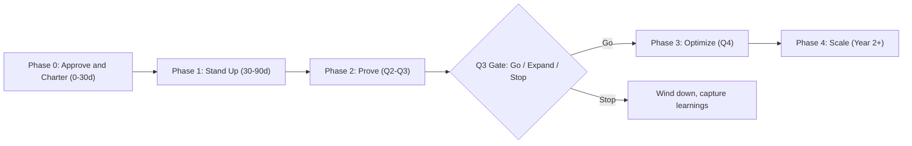

# 07 · Roadmap & Risks

> **Summary.** The phased rollout from approval through the Year-1 pilot and into scale, the milestones and success criteria at each gate, and a full risk register with mitigations. The design deliberately bounds downside: a mid-pilot go/expand/stop gate stops spend before it can turn negative.

---

## 1. Phased rollout

### Phase 0 — Approve & charter (0–30 days)
- Secure funding approval (this business case).
- Name the **Chief Field CTO / group lead**.
- Baseline the charter, comp model ([`05`](05-operating-model.md#6-compensation-design)), influence-ledger method, and KPI dashboard ([`05`](05-operating-model.md#7-kpi-framework)).
- Confirm org placement (GTM-primary, CTO-dotted — see [`03`](03-role-requirements.md#5-coverage--org-model)).

**Key deliverables:** signed charter; comp/credit model; KPI dashboard spec; influence-ledger design. **Owner:** exec sponsor + Chief Field CTO.
**Exit criteria:** funded, led, chartered; metrics and comp defined.

### Phase 1 — Stand up (30–90 days)
- Staff the first cohort **internal-first**, selective external hires for gaps.
- Select ~48 named accounts + paired control accounts across the four verticals.
- Run the enablement ramp (Foundation + vertical immersion + shadowing).
- Publish the initial play library and reference-architecture standards.

**Key deliverables:** staffed cohort; named-account + control list; play library v1; reference-architecture standards. **Owner:** Chief Field CTO.
**Exit criteria:** team staffed; accounts + controls selected; first executive framings scheduled.

### Phase 2 — Prove (Q2–Q3)
- Execute the engagement lifecycle on target accounts.
- Frame X-Arch opportunities; produce reference architectures and value cases.
- Track touched-vs-control deltas weekly; run the deal-desk influence ledger.

**Key deliverables:** framed X-Arch opportunities; reference architectures + value cases; live touched-vs-control deltas. **Owner:** Field CTOs + deal desk.
**Exit criteria:** pipeline building toward target; early attach/deal-size deltas visible.

### Q3 GATE — Go / expand / stop (decision point)
Evaluate against the success criteria in §2. Three outcomes:
- **Go:** continue Phase 3 as planned.
- **Expand:** accelerate hiring into Year-2 scale early.
- **Stop:** wind down, capture learnings; spend is bounded to date.

### Phase 3 — Optimize (Q4)
- Refine plays from win/loss; deepen the strongest verticals.
- Convert early wins into references and expansion pipeline.
- Prepare the pilot readout and scale recommendation.

**Exit criteria:** pilot readout; validated ROI; scale plan.

### Phase 4 — Scale (Year 2+)
- Expand headcount per the 3-year path ([`06`](06-financial-model.md#4-three-year-illustrative-pl-scale-path)).
- Add verticals/regions; mature the play library; formalize L2 Principal roles.

---

## 2. Milestones & success criteria

| Timeframe | Milestone | Success criterion |
|-----------|-----------|-------------------|
| 30 days | Group lead + charter | Funded, led, metrics baselined |
| 60 days | Cohort staffed; accounts + controls selected | Team in seats; target list locked |
| 90 days | First X-Arch opportunities framed | ≥ 1 executive-framed opp per Field CTO |
| Q2 | Pipeline building | Influenced pipeline on trajectory to $180M |
| **Q3 (gate)** | Go/expand/stop decision | Touched > control on attach & deal size; positive BU sentiment; pipeline on track |
| Q4 | Pilot readout | Validated ROI; scale recommendation approved |
| Year 2 | Scale underway | Team expanded; efficiency (ROI multiple) improving |

**Primary evidence at the gate:** touched accounts materially outperform control accounts on (a) Splunk cross-attach, (b) average deal size, and (c) win rate — the three deltas that prove the X-Arch motion works.

---

## 3. Risk register

Likelihood/Impact: **L / M / H**.

| # | Risk | L | I | Mitigation | Owner |
|---|------|:-:|:-:|-----------|-------|
| R1 | **Talent scarcity** — the senior, business-fluent, multi-architecture profile is rare | H | H | Internal-first sourcing; selective external hires; structured ramp; start small (8) | Group lead |
| R2 | **Quota / comp friction** with BU sellers | M | H | Additive influence-credit model; deal-desk arbitration; non-zero-sum design | Sales leadership |
| R3 | **"Just another overlay team" perception** | M | M | Keep it thin & senior; orchestration-first; measured on outcomes not activity | Group lead |
| R4 | **Attribution disputes** (proving influence) | M | M | Control-group method; influence ledger; agreed metrics up front | Deal desk / ops |
| R5 | **Slow ramp / long enterprise cycles** delay Y1 bookings | M | M | Target accounts with live triggers; measure leading indicators; bounded gate | Group lead |
| R6 | **BU resistance** to sharing accounts | M | M | Executive sponsorship; shared-success comp; early quick wins to build trust | Sales leadership |
| R7 | **OT safety incident / trust breach** in Transportation/Utilities (rail signaling, port/airport automation) | L | H | Hard read-only/passive, human-in-the-loop boundary; OT-eng sign-off; never write to control assets ([`04`](04-vertical-solution-map.md#ot-safety-boundary-mandatory-for-transportation--public-sectorutilities)) | Field CTO + OT eng |
| R8 | **Portfolio/integration gaps** between Cisco & Splunk products | M | M | Lead with mature joint solutions; CTO-dotted line for roadmap access; feed gaps back to BUs | Chief Field CTO |
| R9 | **Executive access** hard to obtain | M | M | Leverage existing account-team relationships; lead with peer-level industry credibility | Field CTO + AE |
| R10 | **Over-expansion** before the model is proven | M | M | Strict Q3 gate; scale only on validated deltas | Sales leadership |
| R11 | **Key-person dependency** (small team) | M | M | Play library codifies knowledge; peer review; cross-vertical coverage | Group lead |
| R12 | **Macro / budget freeze** shrinks enterprise deals | L | M | Consolidation-TCO play thrives in cost-pressure; diversify across 4 verticals | Group lead |

### Early-warning indicators (watch these to act before a risk bites)

| Risk | Leading signal to monitor | Trigger for action |
|------|---------------------------|--------------------|
| R1 Talent | Time-to-fill; ramp certification pass rate | >2 roles unfilled at 60 days → widen sourcing / adjust profile |
| R2/R6 BU friction | BU-team sentiment pulse; ledger disputes | Rising disputes → revisit comp/credit rules |
| R4 Attribution | % touched accounts with matched control | <80% matched → fix tracking before the gate |
| R5 Ramp | Time-to-first-framing; opportunities framed/FCTO | Behind at 90 days → targeting review |
| R9 Exec access | Executive relationships created/month | Flat → co-selling plan with account teams |
| R8 Integration gaps | Deals stalled on product/integration gaps | Pattern emerges → escalate via CTO-dotted line |

---

## 4. Governance & reporting cadence

| Cadence | Forum | Purpose |
|---------|-------|---------|
| Weekly | Deal sync (Field CTO + AE + specialists) | Move active deals; unblock |
| Monthly | Group review (led by Chief Field CTO) | Pipeline, plays, wins/losses, metrics, sentiment |
| Quarterly | Executive review with sponsors | KPI dashboard vs. targets; gate decisions |
| Q3 | **Go/expand/stop gate** | Formal decision against success criteria |
| Q4 | Pilot readout | ROI validation; scale recommendation |

### Program RACI (who does what across the rollout)

Legend: **R** = Responsible · **A** = Accountable · **C** = Consulted · **I** = Informed.

| Activity | Exec sponsor | Chief Field CTO | Field CTOs | Deal desk / ops | Sales leadership |
|----------|:---:|:---:|:---:|:---:|:---:|
| Fund & charter the pilot | **A** | R | I | C | C |
| Name group lead; set comp/metrics | **A** | C | I | C | R |
| Staff cohort (internal-first) | I | **A/R** | C | I | C |
| Select accounts + controls | I | **A** | R | R | C |
| Run engagement lifecycle / plays | I | A | **R** | C | I |
| Maintain influence ledger / attribution | I | C | C | **A/R** | I |
| Q3 gate decision | **A** | R | I | C | R |
| Scale decision (Year 2) | **A** | R | I | C | R |

---

## 5. Definition of success (one screen)

The pilot has succeeded if, at the Q3 gate and Q4 readout:

1. **Touched > control** on Splunk cross-attach, average deal size, and win rate.
2. **Influenced pipeline** is on trajectory to the Year-1 target (~$180M illustrative).
3. **Incremental bookings** comfortably clear the ~$9M break-even ([`06`](06-financial-model.md#3-roi--payback-year-1-pilot)).
4. **BU teams want the Field CTO in the room** (positive sentiment; pull, not push).
5. **A repeatable, documented motion** exists (plays, reference architectures, references) that scales beyond the pilot cohort.

If those hold, expand. If they don't, the bounded spend and clean exit mean the organization has learned cheaply.

---

*This completes the business-case pack. Start at [`README.md`](README.md); the decision request is in [`01-executive-business-case.md`](01-executive-business-case.md).*
