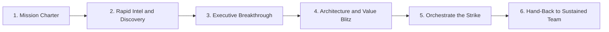

# 09 · The Black Ops Seller — X-Arch Tiger Team

> **Summary.** "Black Ops" is an elite, rapid-deployment **operating mode** within the Field CTO group: a small special-forces "tiger team" that parachutes into the hardest, highest-value, most strategically important accounts to **break them open** — then hands the account back to the standard Field CTO + account team for sustained land-and-expand. It is a *sprint* capability layered on top of the Field CTO *marathon*.
>
> **Name disclaimer:** "Black Ops" denotes the **special-forces posture only** — elite, cross-functional, mission-scoped, time-boxed, outcome-obsessed. It is **fully ethical and above-board**. There are no grey-area tactics, nothing hidden from the customer, and every OT-safety, read-only, and human-in-the-loop guardrail still applies without exception.

---

## 1. Why it exists

The standard Field CTO motion ([`03`](03-role-requirements.md)) is sustained coverage of a named-account portfolio — a marathon. But some opportunities don't yield to sustained coverage alone:

- **Whales that are stuck** — top strategic accounts (potential 9-figure, multi-year) that are stalled, or where a competitor/SI has already locked the reference architecture.
- **Narrow windows** — a regulatory deadline, a breach, an M&A event, a leadership change, or an imminent RFP that demands senior firepower *now*, not next quarter.
- **Political complexity** — multi-stakeholder accounts where normal coverage can't get executive traction.
- **Greenfield lock risk** — a large new program (e.g., a "smart airport" build) about to be designed by an SI, where whoever frames the architecture first wins the multi-year budget.

For these, you need a concentrated strike of the most senior, cross-architecture talent — deployed fast, on a clear mission, with executive air cover.

## 2. Marathon vs. sprint — how Black Ops differs from the standard Field CTO

| Dimension | Field CTO (standard) | Black Ops (tiger team) |
|-----------|----------------------|-------------------------|
| **Motion** | Sustained portfolio coverage (marathon) | Mission-based strike on one target (sprint) |
| **Scope** | 5–8 named accounts | One hard target at a time |
| **Duration** | Ongoing | Time-boxed (typically 60–120 days) |
| **Trigger** | Account plan + business trigger | A "break-open" condition (whale stuck, SI lock, narrow window) |
| **Autonomy** | High | Highest — with direct executive sponsorship |
| **Objective** | Frame → orchestrate → land → expand | **Breakthrough**: executive access + framed X-Arch architecture + qualified pipeline |
| **Exit** | Continuous | **Hand-back** to Field CTO + account team for sustained close & expand |

The critical design principle: **Black Ops does not keep the account.** Its job is to break it open and hand it back, so the sustained team can close and grow it. This prevents key-person dependency and keeps the tiger team available for the next hard target.

## 3. When to deploy (deployment criteria)

Convene a Black Ops mission only when **≥ 2** of the following hold:

1. **Strategic size** — top-tier whale with outsized, multi-year, multi-architecture potential.
2. **Stalled or locked** — no forward motion, or a competitor/SI owns the current frame.
3. **Narrow window** — a dated event (RFP, mandate, breach, M&A) creates urgency.
4. **Executive inaccessibility** — the account team cannot get to the decision-making C-suite.
5. **Disproportionate strategic value** — a lighthouse/reference win that unlocks a segment.

If fewer than two hold, the standard Field CTO motion is the right (cheaper) tool. Black Ops is scarce, senior firepower — rationed deliberately.

## 4. Composition (the mission pod)

A Black Ops pod is assembled per mission from the group's most senior talent plus on-demand specialists:

| Role | Who | Contribution |
|------|-----|--------------|
| **Black Ops lead** | Most senior Field CTO (L2 Principal / L3) | Owns the mission; the executive breakthrough |
| **X-Arch solution architect** | From the group | Blitz reference architecture |
| **Splunk + security + networking specialists** | On-demand from BUs | Deep credibility per pillar |
| **Value engineer** | Shared | Rapid TCO/ROI/risk case |
| **Executive sponsor** | Cisco senior exec | Peer-level air cover, door-opening |
| **Account exec / GAM** | Existing | Continuity + hand-back landing |
| **Partner / CX** | As needed | Delivery credibility |

Small, senior, cross-architecture, and disbanded back to their day roles when the mission ends.

## 5. The mission lifecycle

| Stage | Days (typical) | What happens | Output |
|-------|----------------|--------------|--------|
| **1. Mission charter** | 0–5 | Chief Field CTO scopes the target, objective, pod, and time box | Charter + success definition |
| **2. Rapid intel & discovery** | 5–20 | Deep account/competitor/stakeholder intelligence; map the buying group | Account intelligence brief |
| **3. Executive breakthrough** | 15–45 | Secure and run the CxO conversation; reframe the outcome | Executive alignment |
| **4. Architecture & value blitz** | 30–70 | Co-author the X-Arch reference architecture + value case at speed | Reference architecture + value case |
| **5. Orchestrate the strike** | 50–100 | Mobilize specialists/partners; land the framed opportunity in pipeline | Qualified multi-arch pipeline |
| **6. Hand-back** | 90–120 | Transition to Field CTO + account team for sustained close/expand | Documented hand-back + plan |

## 6. Measurement & compensation

Because the mission is breakthrough-then-handback, measurement blends **mission success** with **downstream influence**:

| Component | Basis |
|-----------|-------|
| **Mission success (primary)** | Breakthrough achieved: executive access created + X-Arch architecture framed + qualified pipeline generated within the time box |
| **Influence credit (downstream)** | Additive credit on bookings from the account after hand-back (shared with the sustained team) |
| **Leading indicators** | # of break-opens, executive relationships created, competitive/SI displacements, lighthouse references |

As with the standard role, credit is **additive and non-zero-sum** — the sustained Field CTO and account team keep their credit; the influence ledger ([`05`](05-operating-model.md#7-kpi-framework)) records the Black Ops contribution.

## 7. Guardrails (non-negotiable)

- **Ethical and transparent.** "Black Ops" is a posture metaphor. All engagement is above-board; nothing is concealed from the customer. No grey-area competitive tactics.
- **OT safety unchanged.** Every read-only / passive-acquisition / human-in-the-loop rule from [`04`](04-vertical-solution-map.md#ot-safety-boundary-mandatory-for-transportation--public-sectorutilities) applies fully. Speed never overrides safety.
- **Always hand back.** The pod does not hoard the account; failure to hand back is a mission failure.
- **Rationed.** Deployed only when the deployment criteria (§3) are met, to preserve scarce senior capacity and avoid dilution.
- **Additive, not territorial.** Reinforces account/BU teams; never displaces or overrides their accountability.

## 8. Org fit & pilot recommendation

Black Ops is an **operating mode within the Field CTO group**, drawn from the same talent pool — not (initially) a separate headcount. It maps to the L2 Principal / L3 tier in the [leveling model](03-role-requirements.md#4-leveling).

**Pilot recommendation:** designate a **tiger-team capability** equal to roughly **20% of the group's senior capacity** (e.g., the group lead + 1–2 principals available for missions), governed by the Chief Field CTO. If demand proves out, formalize **1 dedicated Black Ops lead** in the Year-2 scale plan ([`07`](07-roadmap-risks.md#phase-4--scale-year-2)). This keeps the pilot lean while proving the sprint capability alongside the marathon.

## 9. RACI (mission)

Legend: **R** = Responsible · **A** = Accountable · **C** = Consulted · **I** = Informed.

| Activity | Chief Field CTO | Black Ops lead | Exec sponsor | Account exec | Field CTO (sustained) |
|----------|:---:|:---:|:---:|:---:|:---:|
| Approve mission + charter | **A/R** | C | C | C | I |
| Executive breakthrough | C | **A/R** | R | C | I |
| Architecture & value blitz | I | **A/R** | I | C | C |
| Orchestrate the strike | C | **A/R** | C | R | C |
| Hand-back to sustained team | **A** | R | I | R | **R** |
| Downstream close & expand | I | C | I | R | **A/R** |

---

## 10. One-line positioning

> The Field CTO group runs the **marathon**; Black Ops runs the **sprint** — an elite tiger team that breaks open the accounts nobody else can, then hands them back to be closed and grown.

*See this capability applied end-to-end in [`10-example-engagement-aviation.md`](10-example-engagement-aviation.md), where a Black Ops pod breaks open a stalled international-airport "smart airport" program.*
