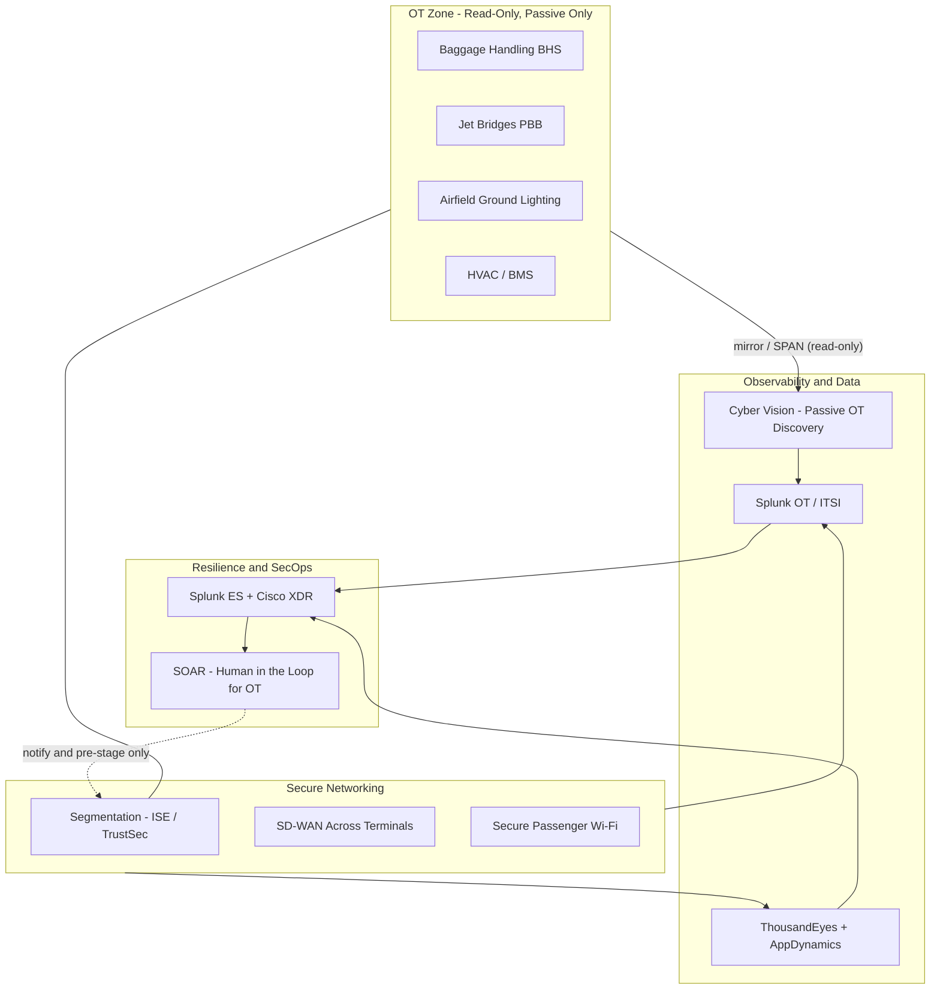

# 10 · Example Engagement — International Airport Operator (Aviation)

> **Summary.** A worked, end-to-end walkthrough of the Field CTO X-Arch motion applied to a major international **airport operator** — an OT-heavy hub under the Transportation & Logistics vertical. It shows the engagement lifecycle, the cross-architecture reference architecture, the OT safety boundary in an aviation context, an illustrative value case, and exactly where the **Black Ops tiger team** ([`09`](09-black-ops-seller.md)) was decisive.
>
> **Everything here is illustrative and fictional.** "Northgate International Airport Authority (NIAA)" is a made-up composite; all figures are parameterized placeholders (see [`06-financial-model.md`](06-financial-model.md)).

---

## 1. The customer (illustrative profile)

**Northgate International Airport Authority (NIAA)** — operator of a large international hub.

| Attribute | Illustrative value |
|-----------|--------------------|
| Passengers / year | ~45M |
| Terminals | 3 (+ a 4th under construction) |
| Estate | Airfield, baggage handling, gates/stands, terminals, cargo, landside/transport interchange |
| IT footprint | Cisco networking incumbent; fragmented monitoring; no Splunk |
| OT footprint | Baggage handling systems (BHS), passenger boarding bridges (PBB / jet bridges), airfield ground lighting (AGL), stand/docking guidance, HVAC/BMS, security screening, CCTV/access control |
| Mandate | Board-approved "resilient, secure, smart airport" program tied to the Terminal 4 build |

## 2. The triggers (why now)

- **A peer airport suffered a ransomware attack** that halted check-in and baggage for a day — the NIAA board demanded a resilience answer.
- **NIS2 / critical-infrastructure obligations** with a compliance deadline.
- **The Terminal 4 "smart airport" program** (digital passenger experience, biometrics, IoT) is being **architected by a systems integrator** — the reference architecture is about to lock.
- **On-time performance (OTP)** pressure: gate/turnaround inefficiency costs money and airline relationships.

These conditions — a stalled whale, an **SI about to lock the architecture**, a dated event (NIS2 + T4), and inaccessible executives — met the **Black Ops deployment criteria** ([`09` §3](09-black-ops-seller.md#3-when-to-deploy-deployment-criteria)). A tiger team was convened.

## 3. Stakeholder map

| Stakeholder | Cares about | Our hook |
|-------------|-------------|----------|
| **CEO / Managing Director** | Reputation, passenger trust, growth (T4) | "A resilient, secure smart airport that protects the brand" |
| **COO / Director of Operations** | OTP, turnaround, safety, uptime | "See and optimize every gate, bag, and stand — safely" |
| **CISO** | Ransomware, NIS2, IT/OT threat exposure | "One correlated view from airfield OT to the SOC" |
| **CIO / Head of Digital** | Passenger apps, FIDS, Wi-Fi, T4 digitization | "Full-stack visibility of the passenger digital journey" |
| **Head of Engineering / OT** | Airfield & baggage safety and availability | "Passive, read-only visibility — we never touch your controllers" |
| **CFO** (validator) | ROI, consolidation, risk-adjusted spend | "A funded consolidation with a hard resilience payback" |

## 4. The engagement lifecycle (as it played out)

Following the standard lifecycle ([`05` §1](05-operating-model.md#1-engagement-lifecycle)), accelerated by the Black Ops mission lifecycle ([`09` §5](09-black-ops-seller.md#5-the-mission-lifecycle)).

### Stage 1 — Select & trigger (Black Ops mission charter)
NIAA qualified as a stalled whale with an SI about to lock the T4 architecture. Chief Field CTO chartered a Black Ops pod: a Black Ops lead, an X-Arch architect, Splunk/security/networking specialists on-demand, a value engineer, and a Cisco executive sponsor.

### Stage 2 — Rapid intel & executive breakthrough
The pod mapped the buying group and used the peer-airport ransomware event as the door-opener. The **executive sponsor secured a CEO/COO/CISO session** the account team had not been able to land. The reframe: **"keep the airport running safely and securely — even under attack — while we digitize for T4."** This moved the conversation from "SI's smart-airport IT project" to "board-level operational resilience."

### Stage 3 — X-Arch reference architecture (the blitz)
The pod co-authored one reference architecture spanning the "3 + 1" pillars, deliberately isolating and protecting OT:

**By pillar:**

| Pillar | What NIAA gets |
|--------|----------------|
| **Secure Networking** | Segmentation isolating OT (BHS, AGL, PBB) from IT to contain ransomware blast radius; SD-WAN resilience across terminals; secure passenger Wi-Fi; Zero Trust (ISE/Duo) |
| **Observability & Data** | Cyber Vision passively discovers airfield/baggage assets → Splunk OT + ITSI for asset inventory and operational health (baggage throughput, stand/gate ops); ThousandEyes + AppDynamics for the passenger digital journey (app, FIDS, check-in) |
| **Resilience & SecOps** | Splunk ES + Cisco XDR modern SOC; aviation-specific detections; automated response that **notifies and pre-stages only** on the OT side |
| **AI-Ready Infra** | Edge compute for airfield/turnaround vision analytics (OTP optimization) at T4 |

### Stage 4 — Value case
Co-built with the CFO's team; illustrative and parameterized:

| Value lever | Illustrative basis | Illustrative impact |
|-------------|--------------------|---------------------|
| Downtime avoidance | Cost of a disrupted operational hour × avoided hours | Multi-$M/yr risk reduction |
| Ransomware resilience | Segmentation + SOC reducing blast radius & dwell time | Lower breach likelihood/impact |
| OTP improvement | Better gate/turnaround visibility | Higher on-time %; airline goodwill |
| Consolidation TCO | Replace fragmented monitoring tools | Lower run cost |
| NIS2 evidence | Automated compliance reporting | Reduced audit effort; deadline met |

### Stage 5 — Orchestrate the strike
The pod pulled in BU networking/security sellers, the Splunk specialist, and a delivery partner (with the SI repositioned as a *delivery* partner, not the architect). The framed opportunity — a **phased, multi-year program** anchored to T4 — entered pipeline.

### Stage 6 — Hand-back to sustained team
With the account broken open (executive access + framed X-Arch architecture + qualified pipeline), the Black Ops pod **handed back** to the account's standard Field CTO + account team for sustained close and expand (phase 2: cargo, second airport in the group).

## 5. OT safety boundary in aviation (applied)

Aviation OT is operationally and safety critical. This engagement operated strictly within the boundary ([`04`](04-vertical-solution-map.md#ot-safety-boundary-mandatory-for-transportation--public-sectorutilities)):

- **Read-only / passive acquisition only** on baggage (BHS), jet bridges (PBB), airfield ground lighting (AGL), and BMS — via SPAN/mirror and Cyber Vision passive DPI. **No active probing** of any airfield or baggage controller.
- **Never write configuration** to any OT/control-layer asset.
- **Human-in-the-loop** — SOAR may notify and pre-stage on the OT side; any containment touching operational systems requires an airport-engineering decision. SOAR automation scope ends at the IT / IT-OT DMZ.
- **We do not touch air traffic control / ANSP** safety systems — out of scope by design.

This was decisive in winning the Head of Engineering's trust — the very stakeholder most likely to veto an IT-led security program.

## 6. Where Black Ops was decisive

| Without Black Ops | With Black Ops |
|-------------------|----------------|
| Account stalled; SI locking the T4 architecture | Executive breakthrough reframed it as board-level resilience |
| Three siloed Cisco/Splunk conversations | One co-authored reference architecture |
| Cisco bidding on components late | Cisco co-owns the frame; SI repositioned as delivery |
| No executive access | CEO/COO/CISO engaged via executive sponsor |
| Slow, opportunistic | Time-boxed breakthrough, then handed back to scale |

## 7. Illustrative outcome & deal shape

| Item | Illustrative |
|------|--------------|
| Program shape | Phased, multi-year, multi-architecture (anchored to T4) |
| Architectures in the deal | 3–4 (Networking, Observability/Data, SecOps, +Edge/AI) |
| Relationship shift | Supplier → strategic resilience partner |
| Expansion path | Cargo operations; second airport in the group; biometric passenger flow |
| Mission time box | ~90-day breakthrough → sustained close & expand |

## 8. Objections handled

| Objection | Response |
|-----------|----------|
| "The SI already owns the T4 design." | Co-author the resilience/security architecture at board level before design locks; reposition the SI as a delivery partner. |
| "You can't touch our airfield or baggage systems." | Correct — passive, read-only acquisition only; we never write to a controller. |
| "We already have a monitoring tool." | This correlates OT + IT + passenger digital + security in one place, not four silos. |
| "Security will slow operations." | Segmentation + observability improve uptime and OTP — which *is* operational performance. |
| "Budget sits in separate teams." | Frame at board resilience level, where the T4 and resilience budgets consolidate. |

## 9. Which plays this engagement combined

From the [play library](05-operating-model.md#2-the-plays-repeatable-motions):
**Passive OT visibility** (airfield/baggage) + **Splunk-attach-to-network** (existing Cisco estate) + **SOC modernization** (Splunk ES + XDR) + **Full-stack digital experience** (passenger apps/FIDS) + **Consolidation TCO** — assembled into one board-level outcome.

---

*This example ties together the whole pack: the motion ([`05`](05-operating-model.md)), the vertical map ([`04`](04-vertical-solution-map.md)), the financial logic ([`06`](06-financial-model.md)), and the Black Ops tiger team ([`09`](09-black-ops-seller.md)). Back to the index: [`README.md`](README.md).*
