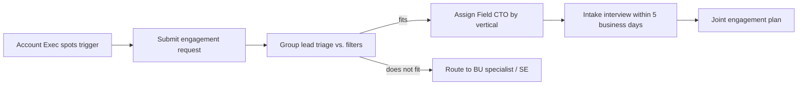

# 11 · Account Team Engagement — The Interview Process

> **Summary.** How account teams engage the Field CTO group, told from the *account team's* point of view. It covers **when** to pull in a Field CTO (qualification), **how** the request works (intake), the **structured discovery interview** the Field CTO runs with the account team, a **value-showcase Q&A** ("what do you actually bring?"), and the **collaboration model** across the deal — including who owns what and how credit works. This is the demand-side companion to the group's own [engagement lifecycle in `05`](05-operating-model.md#1-engagement-lifecycle).

---

## 1. The value in one screen (why an account team calls a Field CTO)

| The account team's problem | What the Field CTO brings | The payoff |
|----------------------------|---------------------------|-----------|
| "We sell great products, but the customer buys in silos." | A **cross-architecture outcome frame** the CxO recognizes as their own business problem | Bigger, multi-architecture deals instead of one line item |
| "We can't get to the C-suite." | A **peer-level technologist** who earns a CIO/CISO/COO conversation | New executive relationships and top-down pull |
| "Splunk isn't attaching to our network wins." | The **attach plays** that connect networking to observability/SecOps | Higher Splunk cross-attach and stickier renewals |
| "The SI owns the architecture, so we're just a BOM." | Someone who **co-owns the reference architecture** and protects margin | Cisco stays strategic, not commoditized |
| "This deal is stuck and I don't know why." | **Diagnosis + an executive reframe** (and, if needed, [Black Ops](09-black-ops-seller.md)) | A stalled account broken open |

**In one line:** the Field CTO turns a product conversation into a *business-outcome* conversation the customer's executives own — and orchestrates the specialists to deliver it, without taking the account team's credit.

## 2. When to engage (qualify first)

A Field CTO is a scarce, senior resource. Engage when **two or more** of these are true; otherwise run the normal specialist motion.

```
Engage a Field CTO when…
- [ ] There is a live business trigger (breach, mandate/regulation, outage, AI build-out, M&A, renewal, expansion)
- [ ] The opportunity spans 2+ architectures (e.g., networking + Splunk, or SecOps + observability)
- [ ] There is (or should be) a C-suite buyer for the outcome
- [ ] The account is strategic (size, reference value, or competitive displacement)
- [ ] The deal is stuck, or the SI/competitor owns the architecture narrative
```

**Do NOT engage for:** single-product transactions, pure renewals with no expansion, or deals already progressing cleanly through a BU specialist. (Fit filters map to the selection criteria in [`05` §1](05-operating-model.md#1-engagement-lifecycle) and the vertical triggers in [`04`](04-vertical-solution-map.md).)

## 3. How the request works (intake)



**What the account team brings to intake (the 5-minute prep):**
- The account, the trigger, and why now
- Current footprint (Cisco + Splunk + competitors) and the SI/partner situation
- Known executives and the relationship status
- The commercial context (open pipeline, renewal dates, budget signals)
- What "a win" looks like in the next two quarters

**Service levels:** triage within 48 hours; intake interview within 5 business days; first executive framing targeted within 30 days of assignment ([`05` §1](05-operating-model.md#1-engagement-lifecycle)).

---

## 4. Part A — The intake / discovery interview

The Field CTO runs this structured interview **with the account team** (AE + SE) to qualify, scope, and build the joint plan. It is deliberately business-first; technology comes later.

### 4.1 Account & relationship
- Who is this customer, and what is their business model and strategy right now?
- What have we sold them, and where are we strong vs. absent?
- Who owns the relationship, and how high does it go today?
- Who else is in the account (competitors, incumbents, SIs)?

### 4.2 Business trigger & outcome
- What changed to make this urgent *now*? (the trigger)
- What business outcome does the customer's leadership care about this year?
- What happens to them if they do nothing? (cost of inaction)
- Whose objective (by name/role) is this, at the executive level?

### 4.3 Technical landscape
- What does the current architecture look like across the "3 + 1" pillars?
- Where are the visibility, resilience, or security gaps?
- What data do they already generate that they can't use? (the Splunk wedge)
- Is OT/ICS in scope? If so, we operate **read-only, passive, human-in-the-loop** — flag it now (see [OT boundary](04-vertical-solution-map.md)).

### 4.4 Commercial & competitive
- What's the budget reality, and which budget line funds this?
- Who are we competing with — for the deal *and* for the architecture narrative?
- Is an SI leading? Do we co-own the architecture or cede it?
- What's the renewal/expansion timing we can anchor to?

### 4.5 Stakeholders & decision process
- Map the buying group: economic buyer, technical buyer, champion, blockers.
- How do they buy (direct, SI-led, framework/consortium, procurement cycle)?
- Who can we get to, and who do we need help reaching?

### 4.6 Success criteria & next step
- What does success look like in 30 / 60 / 90 days?
- What is the single most valuable next action, and who owns it?
- What's the executive framing meeting we can book, and with whom?

**Output of Part A:** a one-page **joint engagement plan** — trigger, target outcome, lead pillar + cross-attach, stakeholder map, next executive action, and RACI (see §6).

---

## 5. Part B — The account team interviews the Field CTO (value showcase)

A candid Q&A account teams can use to understand — and pressure-test — what a Field CTO brings. Use it in onboarding, or when an AE is deciding whether to engage.

**Q: I already have SEs and specialists. What do you do that they don't?**
A: They go deep in one architecture; I connect *several* into one business outcome and take it to the C-suite. I don't replace them — I create the frame that pulls them all in, so each closes more of their own product.

**Q: Will you take my credit or my account?**
A: No. You keep account ownership and your commercials; specialists keep 100% of their product credit. My credit is *additive* influence credit recorded in the ledger ([`05` §6](05-operating-model.md#6-compensation-design)). The org is designed so everyone wins by involving me.

**Q: How do you get a CIO/CISO meeting I can't get?**
A: I show up as a peer technologist with a point of view on *their* business problem and their industry's regulations — not a product pitch. Executives take that meeting because it's about their outcomes and risks, not our catalog.

**Q: The customer says "we already have a monitoring tool / an SI." Now what?**
A: I reframe from "another tool" to "one correlated view across network, apps, and security," and I co-own the architecture *with* the SI instead of ceding it — protecting our margin and strategic position.

**Q: What actually happens in the first 30 days?**
A: Intake interview, a joint plan, and a booked executive-framing conversation. If the account is stuck or huge, I can convene [Black Ops](09-black-ops-seller.md) — a time-boxed tiger team — to break it open, then hand it back to you.

**Q: How do you prove you added value and didn't just add a person to the deal?**
A: Every touched account is compared to a matched **control account** on attach rate, deal size, win rate, and velocity ([`05` §7](05-operating-model.md#7-kpi-framework)). The delta is the proof.

**Q: What won't you do?**
A: I won't take single-product transactions or clean specialist deals, I won't own your commercials, and in OT environments I will never write to control-layer systems. Scarcity and guardrails are what keep the role senior and trusted.

## 6. Part C — Working together across the deal (collaboration model)

The Field CTO maps onto the six-stage lifecycle in [`05` §1](05-operating-model.md#1-engagement-lifecycle). Here is who does what and the value delivered at each stage.

| Stage | Account team (AE/SE) | Field CTO | Value delivered |
|-------|----------------------|-----------|-----------------|
| **1. Select & trigger** | Spot the trigger; submit request; own commercials | Qualify vs. filters; pick lead pillar | Focus on the right account, right reason |
| **2. Executive framing** | Open the door; join the room | Run the CxO outcome conversation | A C-suite buyer and an agreed business problem |
| **3. X-Arch architecture** | Bring technical context | Design the cross-architecture reference architecture | A multi-architecture solution, not a BOM |
| **4. Value case** | Supply account/commercial data | Co-build TCO/ROI/risk with the customer | A business case execs can approve |
| **5. Orchestrate & close** | Own the deal; run the close | Pull in the right specialists at the right time | Bigger, coordinated multi-arch proposal |
| **6. Land & expand** | Own renewal/expansion | Tee up the next outcome; engage CX early | A reference and a repeatable expansion motion |

### RACI (deal-level, lightweight)

| Activity | Account Exec | Field CTO | BU Specialist / SE | Group Lead |
|----------|:---:|:---:|:---:|:---:|
| Account ownership & commercials | **A/R** | C | C | I |
| Engagement qualification | C | R | I | **A** |
| Executive framing | R | **A/R** | C | I |
| Reference architecture | I | **A/R** | R | C |
| Value case | C | **A/R** | C | I |
| Component close | **A/R** (deal) | C | **R** (their line) | I |
| Credit / attribution | R | R (influence) | R (product) | **A** |

*A = Accountable · R = Responsible · C = Consulted · I = Informed.* Full org-level RACI in [`03` §8](03-role-requirements.md#8-raci-vs-existing-teams).

## 7. Handoff & credit (non-zero-sum)

- The Field CTO **frames and orchestrates**, then hands sustained execution back to the account team and specialists.
- Credit is **additive**: BU sellers keep all product credit; the Field CTO earns influence credit via the ledger; disputes are arbitrated by deal desk ([`05` §6](05-operating-model.md#6-compensation-design)).
- For the hardest accounts, the [Black Ops](09-black-ops-seller.md) tiger team accelerates stages 2–4 and then explicitly hands back to normal coverage — see the worked [aviation engagement](10-example-engagement-aviation.md) for how this plays out end to end.

## 8. One-page engagement checklist

```
Before you engage:
- [ ] Confirmed a live business trigger
- [ ] Opportunity spans 2+ architectures
- [ ] There is (or should be) a C-suite buyer
- [ ] Account is strategic OR the deal is stuck / SI owns the narrative

To request:
- [ ] Submitted engagement request with account, trigger, footprint, execs, commercials
- [ ] Prepared the 5-minute intake prep (§3)

During the engagement:
- [ ] Completed the intake interview (Part A)
- [ ] Produced a one-page joint engagement plan (trigger, outcome, pillars, stakeholders, next action, RACI)
- [ ] Booked an executive-framing meeting within 30 days
- [ ] Agreed handoff and credit up front (§7)
```

---

*Related: the group's internal lifecycle and KPIs in [`05-operating-model.md`](05-operating-model.md); the vertical discovery kits in [`04-vertical-solution-map.md`](04-vertical-solution-map.md); the Black Ops mode in [`09-black-ops-seller.md`](09-black-ops-seller.md); a full worked engagement in [`10-example-engagement-aviation.md`](10-example-engagement-aviation.md).*
