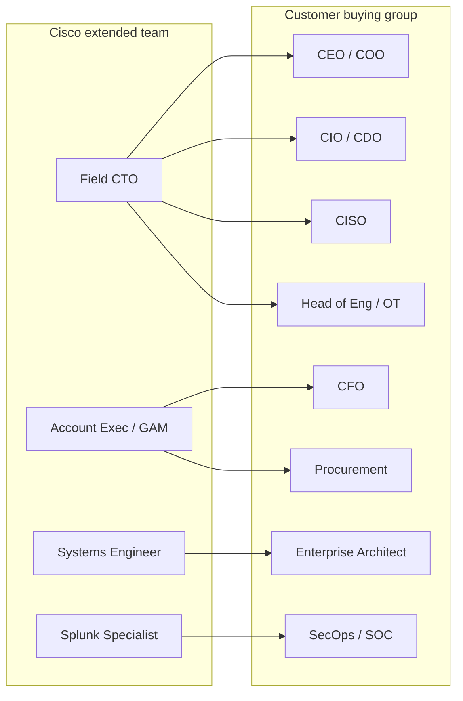

# 12 · Cross-Stakeholder Value — Selling Business Outcomes Across the C-Suite

> **Summary.** Cross-architecture selling has an org-chart twin: **cross-stakeholder selling.** The same instinct that connects the *arrows between technologies* connects the *arrows between the customer's executives*. A single-product deal maps to one stakeholder; a business-outcome deal maps to a **coalition**. This playbook shows how Field CTO sellers map the customer's buying group, translate **one shared business outcome** into each stakeholder's language and metrics, build the coalition, reconcile conflicting incentives, and avoid the single-threaded deals that keep opportunities small. It is the demand-side complement to the buyer personas in [`02` §"Executive buyers"](02-market-strategy.md) and the account-team mechanics in [`11`](11-account-team-engagement.md).

---

## 1. The thesis — cross-architecture *is* cross-stakeholder

Buyers fund **outcomes**, and outcomes are owned by *several* executives at once (see the two forces in [`02` §1](02-market-strategy.md)). So the technical breadth of an X-Arch deal only converts if it is matched by **stakeholder breadth** across the customer.

| Siloed product sale | Cross-stakeholder outcome sale |
|---------------------|--------------------------------|
| One seller ↔ one manager | Field CTO orchestrates a **coalition** of executives |
| Framed as a technology purchase | Framed as a **business outcome** the board recognizes |
| Budget from one line item | Budget **converges** from several owners around one program |
| Easy to defer, easy to displace | Board-level, multi-threaded, hard to dislodge |

**The Field CTO's job:** find the business outcome that *several* executives already care about, then make each of them see their own win in one shared architecture.

## 2. The customer buying group (stakeholder map)

Map every account against this group. Not all are present in every deal, but the **economic buyer, a champion, the technical validator, and any blocker** must be identified before the deal is real.

| Stakeholder | Outcome they own | What they fear | The hook (in their language) | Resonant pillar(s) | Typical deal role |
|-------------|------------------|----------------|------------------------------|--------------------|-------------------|
| **CEO / Managing Director** | Growth, brand, strategic bets | A public failure or breach; falling behind | "A resilient, secure platform that protects the brand and enables growth" | All (as outcome) | Sponsor / vision |
| **COO / Head of Operations** | Uptime, throughput, safety | Downtime, safety incident, missed SLAs/OTP | "See and optimize every operation — safely, in real time" | Observability, Networking, (OT) | Economic buyer (ops) |
| **CFO** | ROI, risk-adjusted spend, consolidation | Overspend; unquantified risk | "A funded consolidation with a hard TCO and a resilience payback" | Any (TCO) | Validator / gatekeeper |
| **CIO / Head of Digital (CDO)** | Modernization, reliability, digital experience | Tool sprawl, outages, a failed transformation | "One integrated stack, fewer vendors, full-stack visibility, lower TCO" | Networking, Observability | Economic / technical buyer |
| **CISO** | Cyber risk, resilience, board reporting | Breach, ransomware, audit findings | "One correlated view, network to SOC, with resilience you can report to the board" | Resilience & SecOps, Observability | Economic buyer (security) / champion |
| **Head of Engineering / OT** | Safety & availability of control systems | An IT program that touches or destabilizes OT | "Passive, read-only visibility — we never touch your controllers" | Observability (passive), Networking (segmentation) | Technical validator / **potential blocker (veto)** |
| **LOB / Business-unit leaders** | Their P&L and service metrics | Disruption to their line of business | "Better service metrics, with no disruption" | Varies by line | Influencer / champion |
| **Enterprise / Chief Architect** | Standards, integration, roadmap fit | Point solutions, integration risk, tech debt | "A reference architecture that fits your standards and lowers integration risk" | All | Technical buyer / gatekeeper |
| **Procurement / Vendor management** | Commercial terms, vendor rationalization | Lock-in, weak terms | "Consolidation that simplifies your vendor portfolio" | — (commercial) | Gatekeeper |
| **Board / Audit & Risk committee** | Enterprise risk, compliance | Regulatory failure; material risk | "Demonstrable resilience and compliance evidence (NIS2 / DORA / HIPAA / NERC-CIP)" | Resilience & SecOps | Ratifier |

*Deal roles:* **economic buyer** (funds it) · **technical buyer** (approves the how) · **champion/mobilizer** (sells internally when we're not in the room) · **validator** (CFO/risk sign-off) · **gatekeeper** (procurement/architecture standards) · **blocker** (can veto — often OT) · **ratifier** (board).

## 3. Outcome-first framing — the cascade

Start from **one shared business outcome**, then cascade it into each stakeholder's language and a metric they already report. Same outcome, same architecture — many doors.

**Worked cascade — shared outcome: "Keep operations running safely and securely, even under attack."**

| Stakeholder | Their translation | Metric that moves |
|-------------|-------------------|-------------------|
| CEO / MD | "No headline-making outage; growth protected" | Reputational/continuity risk |
| COO | "Every asset visible; disruptions caught early" | Operational uptime %, throughput/OTP |
| CISO | "Contain blast radius; prove resilience to the board" | MTTD / MTTR; breach likelihood |
| CIO / CDO | "One correlated view instead of four consoles" | Tool count; MTTR; DX score |
| Head of Eng / OT | "Security that never touches my controllers" | Zero OT config changes; safety record |
| CFO | "A payback I can defend" | TCO; downtime-$ avoided; risk-adjusted ROI |

**How to build one:** (1) name the outcome in the customer's words; (2) for each stakeholder, write a one-sentence translation + the metric they own; (3) confirm the metric with them in discovery ([`04` field kits](04-vertical-solution-map.md)); (4) show the *one* reference architecture that moves all of those metrics.

## 4. Translation matrix — any pillar, in any executive's language

Every pillar can be told as *someone's* business outcome. Use this to re-language a technical capability for whoever is in the room.

| Pillar | To the COO | To the CISO | To the CIO/CDO | To the CFO |
|--------|------------|-------------|----------------|------------|
| **Secure Networking** | Segmentation contains disruption; SD-WAN keeps sites up | Zero-trust shrinks the attack surface | One managed fabric, fewer vendors | Fewer outages; lower run cost |
| **Observability & Data** | See and optimize operations in real time | One correlated view across IT/OT/security | Full-stack digital-experience visibility | Consolidate tools → TCO down |
| **Resilience & SecOps** | Operations survive an attack | Faster detection/response; board-ready resilience | Fewer fire-drills; cleaner ops | Quantified risk reduction |
| **AI-Ready Infrastructure** | Predictive/vision analytics improve throughput | Trusted data pipeline for detections | A platform ready for AI workloads | Efficiency and new-revenue upside |

## 5. Coalition mechanics (multi-threading)

**Cover the buying group as a team — never single-thread.** Map who threads to whom so the account is multi-threaded and resilient to a champion leaving.



- **Identify the mobilizer,** not just a friend. A champion sells for us when we're not in the room; a "friendly" who can't mobilize budget is not a champion.
- **Neutralize the blocker early.** In OT verticals the Head of Engineering can veto an IT-led program — win them first with the read-only, human-in-the-loop boundary ([`04` OT boundary](04-vertical-solution-map.md#ot-safety-boundary-mandatory-for-transportation--public-sectorutilities)).
- **Match seniority.** The Field CTO threads CxO; the AE owns commercials/procurement; SE owns the architect; the Splunk specialist owns SecOps ([`05` §5 alignment](05-operating-model.md#5-alignment-model-leverage-not-conflict)).
- **Converge, don't fragment.** Every thread points back to the *same* shared outcome and the *same* reference architecture.

## 6. The cross-stakeholder play (method)

Runs alongside the engagement lifecycle in [`05` §1](05-operating-model.md#1-engagement-lifecycle).

```
- [ ] 1. Map the buying group (table §2); tag economic buyer, champion, validator, blocker
- [ ] 2. Prioritize by power × interest; find the mobilizer and the potential veto
- [ ] 3. Name the ONE shared business outcome (in the customer's words)
- [ ] 4. Write a per-stakeholder outcome statement + metric (cascade §3)
- [ ] 5. Sequence the meetings (win the blocker early; build the coalition)
- [ ] 6. Converge on one reference architecture + one value case
- [ ] 7. Govern the coalition through close and into land & expand
```

## 7. Reconciling conflicting incentives

Executives' goals collide; the Field CTO's value is turning the tension into one architecture everyone can back.

| Tension | The Field CTO's reconciliation |
|---------|--------------------------------|
| CISO wants control/segmentation ↔ COO wants zero operational friction | Segmentation + **passive** observability *improves* uptime; human-in-the-loop on OT means no operational risk |
| CFO wants lowest cost ↔ CIO wants the best platform | The **consolidation TCO** story: fewer tools = lower cost *and* a better integrated platform |
| OT wants no IT interference ↔ CISO wants full coverage | The **read-only / passive** boundary gives coverage without touching controllers |
| LOB wants speed ↔ Architecture/Risk wants governance | A **standards-fit reference architecture** delivers fast *and* clean |
| Procurement wants fewer vendors ↔ teams want best-of-breed | One vendor, **edge to SOC**, is best-of-breed *and* consolidation |

## 8. Worked stakeholder map (aviation)

The airport engagement in [`10`](10-example-engagement-aviation.md#3-stakeholder-map) is a full example: the shared outcome — *"keep the airport running safely and securely, even under attack, while we digitize for Terminal 4"* — aligned the CEO, COO, CISO, CIO, and (critically) the Head of Engineering/OT, with the CFO as validator. Winning the **OT blocker** with the passive, read-only boundary was decisive; the board-level frame is what converged separate budgets into one multi-year program.

## 9. Cross-stakeholder health (metrics)

Leading indicators that predict a healthy, multi-threaded deal — feed the [`05` §7 KPI framework](05-operating-model.md#7-kpi-framework):

- **Executives engaged per account** (target ≥ 3 CxO-level).
- **Coverage completeness** — economic buyer, champion, technical validator, and any blocker all identified and threaded.
- **Champion (mobilizer) confirmed** — someone selling internally when we're absent.
- **Board-level framing achieved** — the outcome is on a board/exec agenda, not just IT's.
- **Per-stakeholder outcome statements** written and validated in discovery.

## 10. Anti-patterns & guardrails

- **Single-threading** — one relationship = one point of failure. Multi-thread by role, not by friendliness.
- **"Champion = economic buyer" fallacy** — confirm who actually funds it.
- **Ignoring the blocker** — an unmanaged OT/architecture/procurement veto kills late-stage deals. Win them early.
- **Pillar-first, not outcome-first** — leading with architecture instead of the shared business outcome shrinks the deal back into a silo.
- **OT safety** — whenever OT stakeholders are in the coalition, the read-only / passive / human-in-the-loop boundary is both the trust-winner and a hard guardrail ([`04`](04-vertical-solution-map.md#ot-safety-boundary-mandatory-for-transportation--public-sectorutilities)).

---

*Related: executive buyer personas in [`02-market-strategy.md`](02-market-strategy.md); the field discovery kits in [`04-vertical-solution-map.md`](04-vertical-solution-map.md); the engagement lifecycle, alignment, and KPIs in [`05-operating-model.md`](05-operating-model.md); the account-team engagement mechanics and RACI in [`11-account-team-engagement.md`](11-account-team-engagement.md); a full worked stakeholder coalition in [`10-example-engagement-aviation.md`](10-example-engagement-aviation.md). Back to the index: [`README.md`](README.md).*
